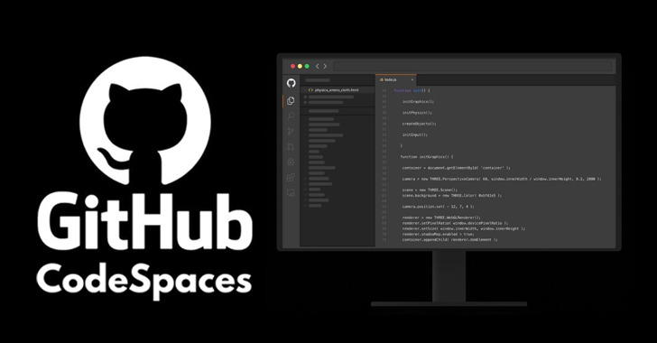

# Copilot Demos for Codespaces

This contains a collection of demos for Copilot using Codespaces** This is going to be useful for customers who are already have Codespaces implemented and view a demo of it in action.

> GitHub Copilot is only available for VS Code, Visual Studio IDE for Microsoft Windows, NeoVim, and IntelliJ and GitHub Copilot is not available for Jupyter Notebooks. Utilizing Copilot in Codespaces allows you to simply the onboarding process for GitHub Copilot.

## Prerequisites

All of demos here will require the following as minimum requirements. Some exercises might have more requirements. 

- The usere is licensed to utilize GitHub Copilot
- The repository you are working on will be have GitHub Codespaces enabled.

[Documentation: How to enable or disable GitHub Codspaces](https://docs.github.com/en/codespaces/managing-codespaces-for-your-organization/enabling-or-disabling-github-codespaces-for-your-organization)

## Demos

Please begin with the Getting Started example and progress through the rest. They should increase in difficulty as new ones get added. 

1. [Getting Started](Demos/GettingStarted/README.md)

## Contribution

If you want to contribute to this repo, please follow the [Contribution Guidelines](CONTRIBUTING.md).

