# How to install Copilot Extension for Visual Studio IDE

This shows how to install Copilot Extension for Visual Studio IDE. You need to install Visual Studio IDE first before you can install Copilot Extension for Visual Studio IDE.

## Step 1: Install Visual Studio IDE

You need to make sure that you installed **Vistual STudio IDE** before installing Copilot extension for Visual Studio IDE.

[Download Visual Studio](https://visualstudio.microsoft.com/downloads/).

> Note that GitHub Copilot for Visual Studio IDE is only available for Windows. If you are using Mac, you can use Copilot through VS Code.

## Step 2: Install Extensions

You can install Copilot extension for Visual Studio IDE through Visual Studio IDE or through Visual Studio Marketplace.

Click **Extensions** in your toolbar then click **Manage Extensions**.

Then search for **Copilot** and click **Download**.

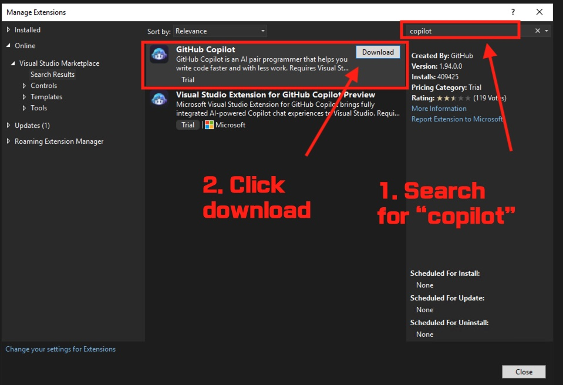

It will be asked to exit Visual Studio IDE.

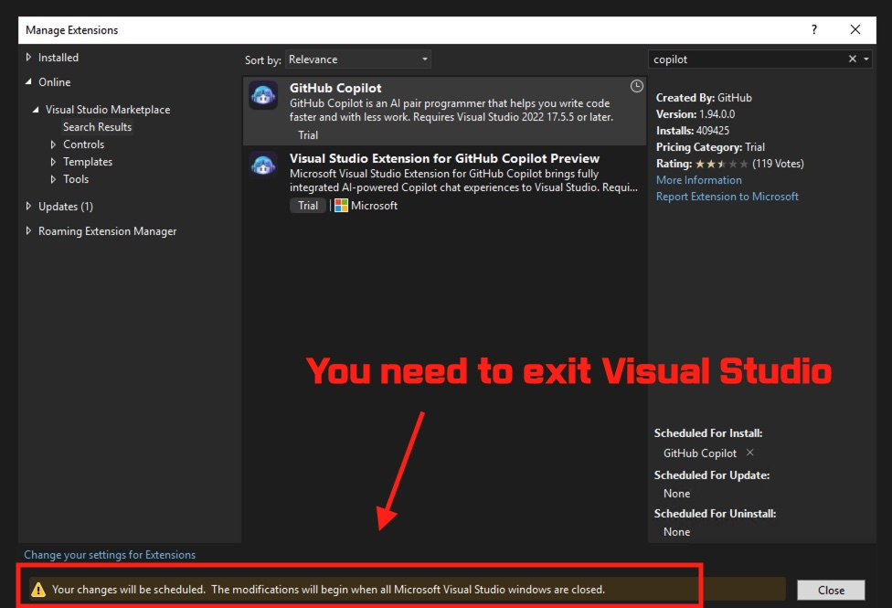

### Possible error message

If you are using an existing Visual Studio IDE, you might get an error message like this:

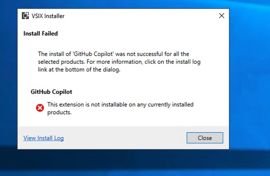

You can also click **View Install Log** to see the details of the error message. 

If so, you need to update to the latest version of Visual Studio IDE. Click **Help** then select **About Microsoft Visual Studio** to check the version of Visual Studio IDE.

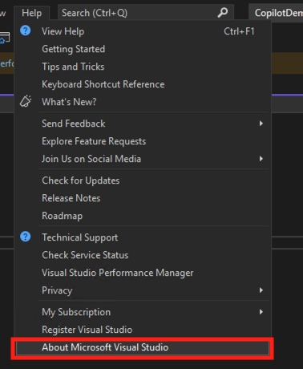.

If you are using an older version of Visual Studio IDE, you need to update to the latest version of Visual Studio IDE. Under **Help**, click **Check for Updates**.

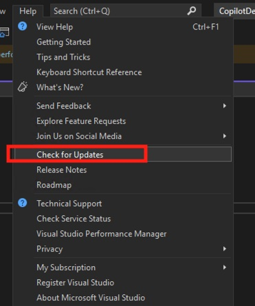

Then, in the pop-up window, click **Update** after checking your version.

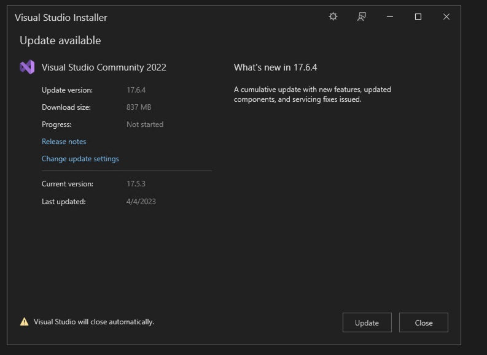

## Step 3: Installing Copilot

After you exit Visual Studio IDE, you will be asked to install Copilot with a following pop-up window. Click **Modify**.

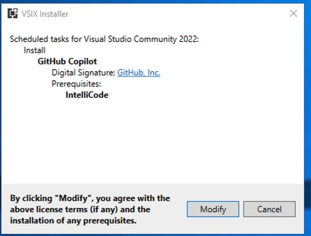

You will see a progress bar.

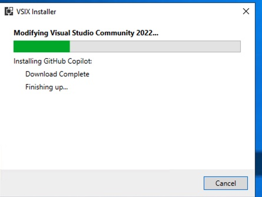

Once it is done, you will see a pop-up window like this. Click **Close**.

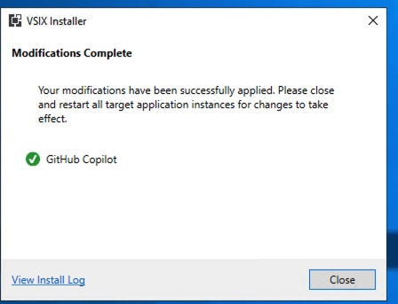

## Step 4: Configure Copilot

Open your Visual Studio IDE. At the bottom, you might notice that **Ouput** window shows that **Auth Status** as **NotSignedIn**.

And on the top, you will see a message indicating that you need to add your GitHub account to use Copilot.

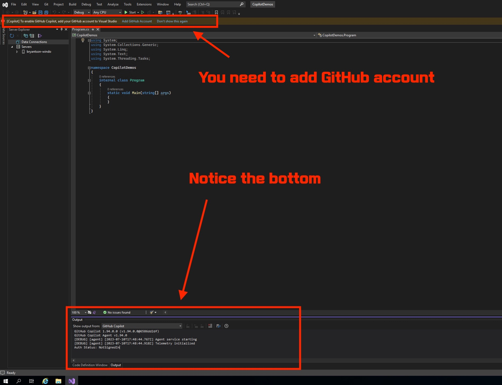

Make sure that you notice that **Auth Status** is **NotSignedIn**. If you don't see that window, you can try to open one.

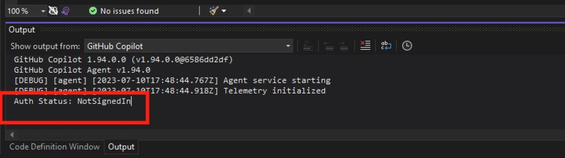

On the top, click **Add GitHub Account**.

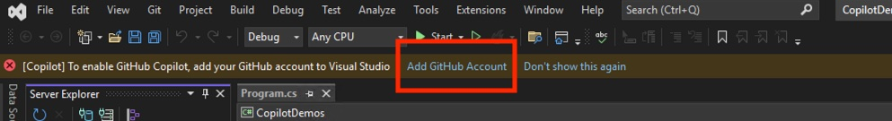

You will see a pop-up window like this. Either add a new GitHub Account or reconnect GitHub Account.

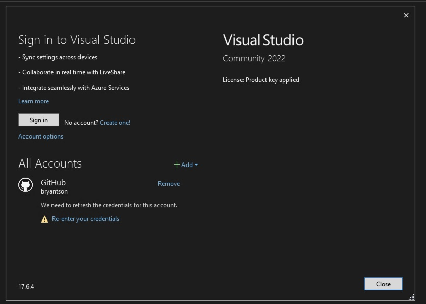

Once you sign in, you will see that your account is connected.

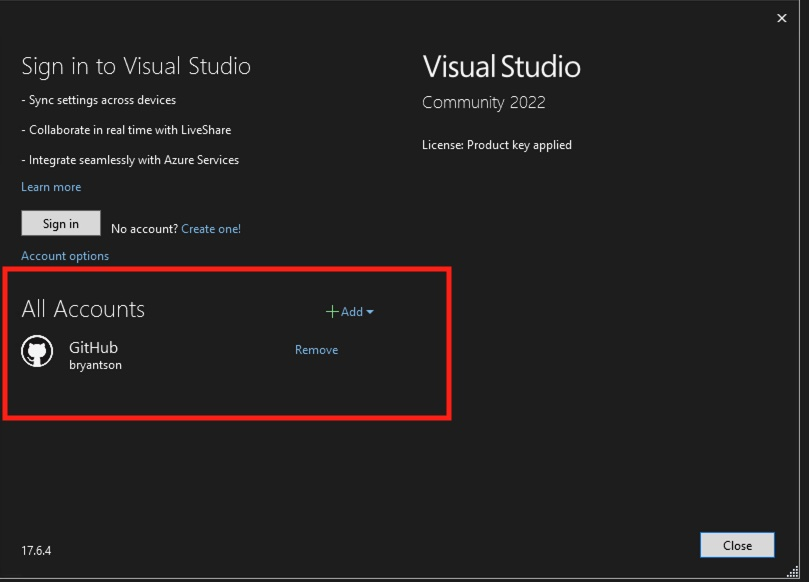

Then, you can see that **Ouput** message shows that you are succesfully signed in.

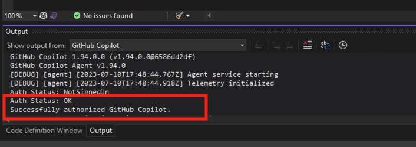

## Step 5: Try Copilot

Now, you can try Copilot. Create a new project and add a new file. Then, you will see that Copilot is working.

