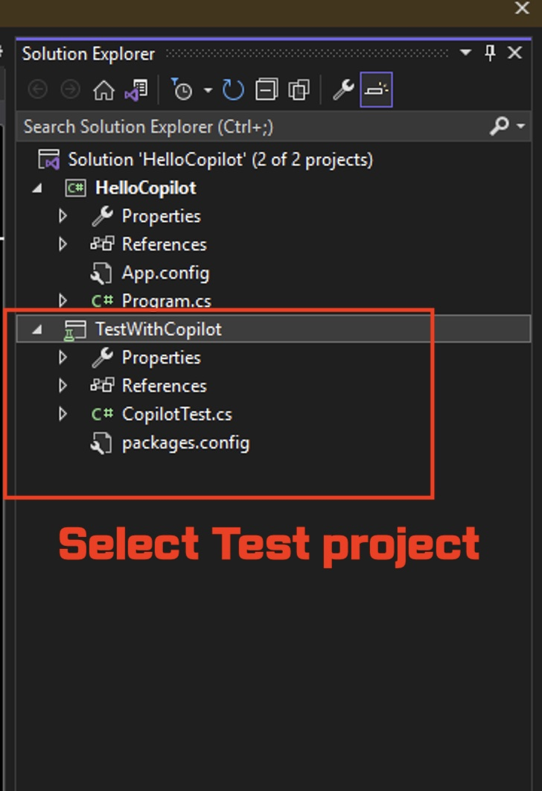
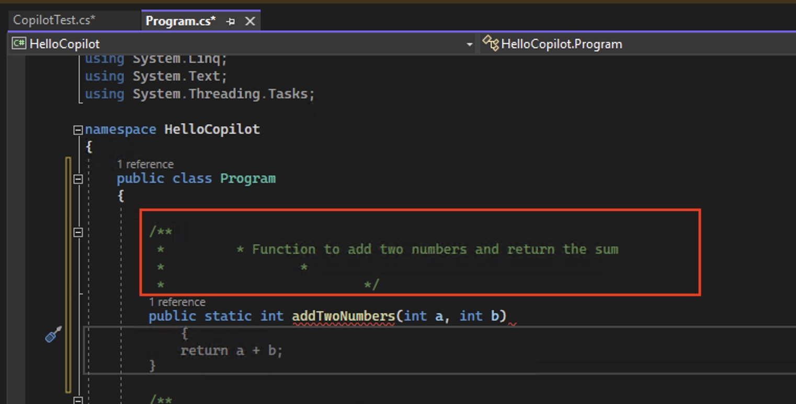
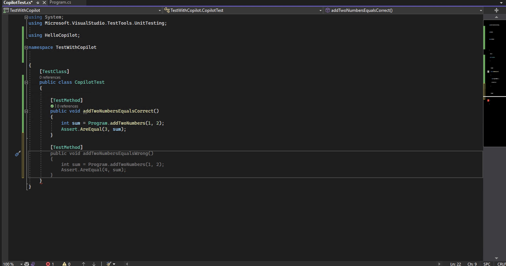

# Test Driven Development (TDD) with C# and .NET through Visual Studio IDE

**Test-Driven Development (TDD)** is a software develpment proces relying on software requirements being converted to test cases before software is fully developed. Since unit testing or any type of functional or performance testings are very important in programming development, TDD practice is very highly encouraged among C# and.NET developers. Copilot is a great tool to help C# and .NET developers to write unit tests for their C# and .NET code as it can helps to bootstrap a lot of repetitive code for unit tests.

As you can see in the picture below, TDD process involves writing tests first, see if it fails (goes to red), then write code to make the test pass (green). Copilot can help you to write the test code and you can focus on writing the code to make the test pass.

This demo is focusing around how to use Copilot to easily write unit tests for C# and .NET code. We will be using Visual Studio IDEA for this demo.

## Prerequisites

Make sure that you meet the following requirements.

- [Visual Studio IDE](https://visualstudio.microsoft.com/downloads/) for Windows
- [Copilot Extension for Visual Studio IDE](https://marketplace.visualstudio.com/items?itemName=GitHub.copilot). 

[See this documentation on how to install Copilot extension for Visual Studio IDE](../CopilotExtensionVS)

## Steps

Please follow this step-by-step guide to get started with Copilot in Visual Studio IDE.

### Step 1: Launch a project Visual Studio IDE

In your Windows, click bottom left's Windows button, then search for `Visual Studio`. Select Visual Studio IDE installed with Copilot.

You can then select an existing project if you followed previous [Getting Started](../GettingStarted/) guide. Or, you can create a new projet if you don't have one.

### Step 2: Add new unit testing Project

Once your Visual Studio IDE is opened, you need to add a new project. From top, click **File** then select **Add**. Click **New Project...**.

From there, search for `test`. You will see **Unit Test Project** shows up, so select that.

Give your unit testing project some name. In my case, I named `TestWithCopilot`. This is going to be my namespace for this project.

Once your new unit test project is created. Verify following things:

- Make sure that your GitHub Copilot is running as seen in the Output window
- Your `namespace` shows what you give as your Project name
- You can see two projects under **Solution Explorer** window

### Step 3: Renaming class and file

Although it is an optional step, we will try to rename our unit testing file and its class. I renmaed mine to **CopilotTest**

I also need to make a change to my file. On **Solutions Explorer** window, select the file to rename.

Once it is done, it shoudld look something like this.

### Step 4: Hook up with dependency

Our unit testing project is dependent on our other project (e.g. HelloCopilot). Thus, we need to add a dependency.

Make sure that you select your unit testing project under **Solution Explorer**.

Then, we need to make following two changes. First, select **Project** under top tool menu. Under a new dropdown menu, scroll down to select **Project Dependencies...**.

Then, check your source code project and click **OK** to save.

Next, we need to add our source code project as a reference to our unit testing project. To do that, select **Project** under tool menu again. But this time, select **Add Reference...**.

Then, click **Projects** followed by **Solution**. You should see your source code project, so select that. Click **OK** button to save.

### Step 5: Build project

Let's build project. On top menu tool bar, click **Build** then select **Build Solution**.

This should print out a message like this under **Output** window.

### Step 6: Getting ready to write unit test

We are finally ready to implement our unit test in TDD style. But first, add the following line in your unit testing class. You need to add your source code project namespace with `using` keyword. For example, in my example below, I added `using HelloCopilot` because `HelloCopilot` is my namespace for my source code project.

You will notice that it generates a sample test method. As you try to type in it, Copilot might generate some test method as you see above.

But there is one change that we definitely need to make before running this, especially if you followed previous [Getting Started](../GettingStarted/) example. In your source code class, change that visibility of class from `internal` to `public`.

Now, we are ready to write actual unit test!

### Step 7: Writing unit tests in TDD style

We could use existing method, but we will just write a new unit test from scratch. Just rename your function to something like `AddTwoNumbersEqualsCorrect`. Then, Copilot will try to generate a test method with a function that does not yet exist.

Let's go to our source code class. As you click under class, you should that Copilot will try to generate suggestion like this based on the method you added in your test class.

Let's accept that suggestion. Next, let's try to build. Click **Build** under tool bar, then select **Build Solution**.

Next, let's try to run unit test. Click **Test** under tool bar, and select **Run All Tests**.

This will bring a pop up window showing that your test is successful. Congratulation! You just wrote a TDD style unit test through C# and .NET.

You can try to add more unit test like this. For example, Copilot automatically suggests some failure scenario for me.

Of course, if you accept the suggestion, it will look like this. But feel free to add your own unit test.

And this is the result after running our second test.

After this, you can add some more custom example using String, sorting function, etc. But as you can see, Copilot can help you eaisly adopt Test Driven Development (TDD) in an easy way as possible. Or, should we say **Copilot Driven Development**?
