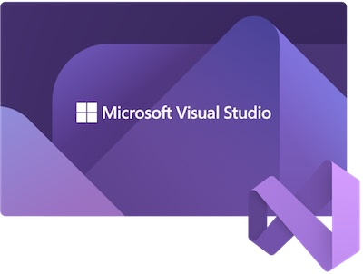
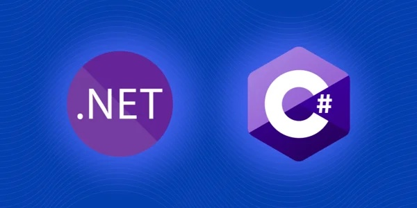

# Copilot Demos for C#, .NET through Visual Studio IDE

This contains a collection of demos for Copilot for **C#** and **.NET** through **Visual Studio IDE.** This is going to be useful for customers who are interested in using Copilot for C# and .NET and want to use Copilot to generate code through Visual Studio IDE.

Note that Copilot extension for Visual Studio IDE is **only available for Windows**. If you are using Mac, you can use Copilot through VS Code.

> GitHub Copilot is only available for VS Code, Visual Studio IDE for Microsoft Windows, NeoVim, and IntelliJ and GitHub Copilot is not available for Jupyter Notebooks.

## Prerequisites

All of demos here will require the following as minimum requirements. Some exercises might have more requirements. This assumes that you have a Windows environment.

- [Visual Studio IDE](https://visualstudio.microsoft.com/downloads/) for Windows
- [Copilot Extension for Visual Studio IDE](https://marketplace.visualstudio.com/items?itemName=GitHub.copilot). 

[See this documentation on how to install Copilot extension for Visual Studio IDE](./CopilotExtensionVS)

## Demos

You want to start with basic one then jump to other ones.

1. [Getting Started](Demos/GettingStarted/README.md)
2. [Test Driven Development (TDD) using C# and .NET through Visual Studio IDE](Demos/TDD-DotNet/README.md)

## Contribution

If you want to contribute to this repo, please follow the [Contribution Guidelines](CONTRIBUTING.md).

