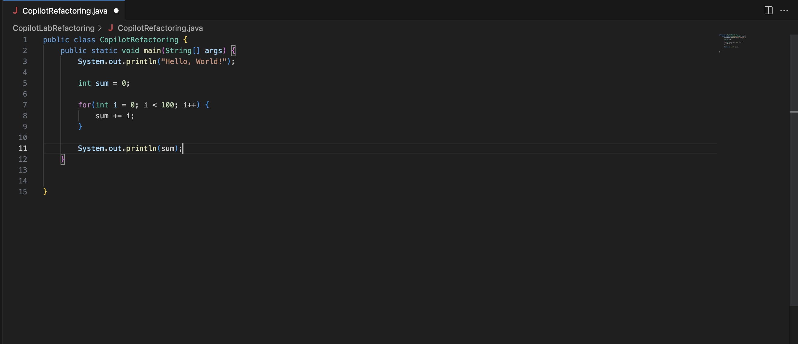
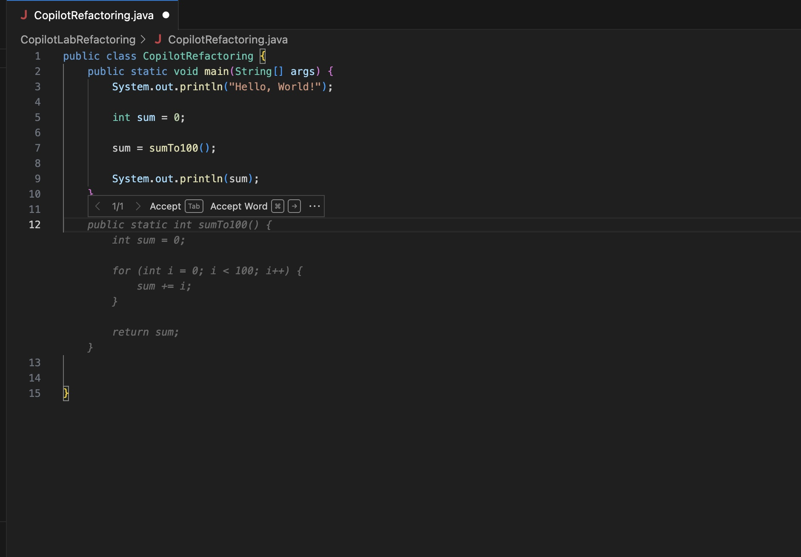
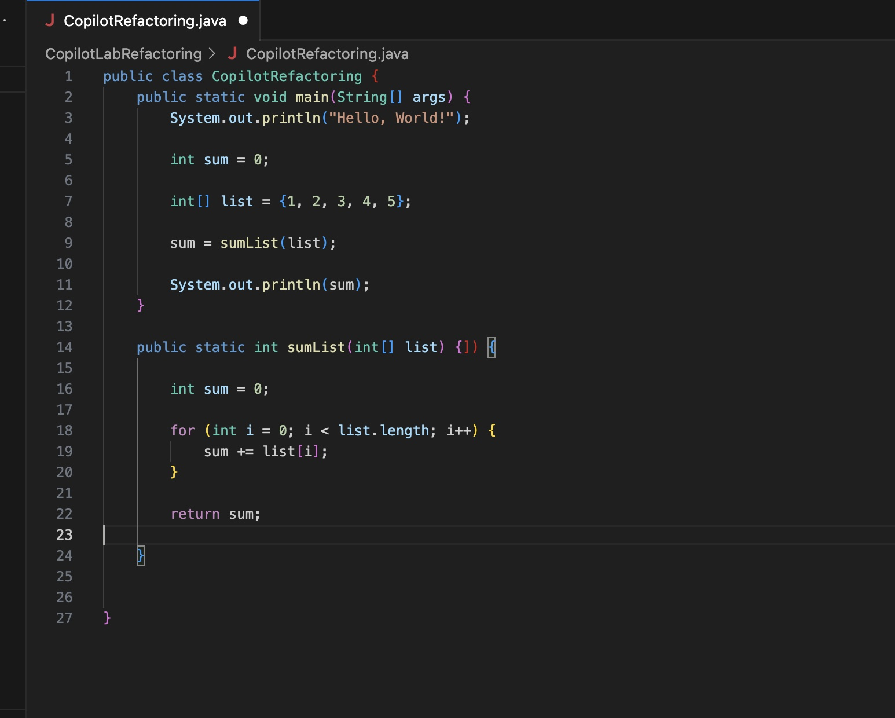
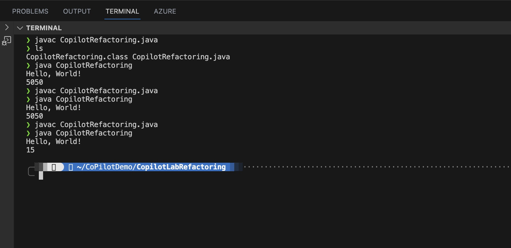

# Refactoring Java codes through Copilot lab in Visual Studio Code

**Refactoring** is an important part of software development. It is a process of changing the internal structure of the code without changing its external behavior. Refactoring is a key to keep your code clean and maintainable. However, refactoring is not easy. It requires a lot of effort and time to refactor a code. Copilot can help you to refactor your code by providing you with a lot of suggestions. In this lab, you will learn how to use Copilot to refactor your Java code.

And most development teams are going work with existing code base. That means that Copilot also needs to work around existing code base. Although Copilot does not yet officially have a support for refactoring, there is Copilot Lab, which is an experimental feature that you can use to refactor your code. Unfortunately, this is only available for Visual Studio Code, not IntelliJ IDEA. Also, note that this is an experimental feature, so it may not work as you expect.

## Prerequisites

- [Copilot Extension for Visual Studio Code](https://code.visualstudio.com/download)
- [Copilot Lab extension for Visual Studio Code](https://marketplace.visualstudio.com/items?itemName=GitHub.copilot-lab)
- [Java SDK to run your code](https://www.oracle.com/java/technologies/javase-downloads.html)

## Steps

Welcome! In this starting Copilot demo for **Refactoring Java codes through Copilot lab in Visual Studio Code**, we will create a simple Java file called `CopilotRefactoring.java` and refactor it using Copilot Lab.

### Step 1: Install GitHub Copilot Lab extension for Visual Studio Code

GitHub Copilot Labs is an experimental feature that you can use to refactor your code. You can install it by going to **Extensions** in Visual Studio Code and search for **Copilot Lab**. Then, click on **Install**.


### Step 2: Create a new Java file

Create a new Java file called `CopilotRefactoring.java`.


You will have a view like below.


You also want to open a terminal by clicking on **Terminal** and select **New Terminal**.


### Step 3: Let's refactor our code

Start typing on your Java class like this.

```java
public class CopilotLabRefactoring {

}
```

As soon as you start hovering your mouse below, you will see a `public static void...` text comes in.


Accept that. Let's start adding some codes to add numbers from one to 100. Copilot will help you generating those code as you start typing in.



Now, on left side, let's click **GitHub Copilot Lab** icon.


Yours will look like this. You need to select code blocks to see suggestions.


If you have not shown the customers about **Translating** feature or **Code Conversation** feature, you can show them now. 


But most important thing is that we want to show code refactoring. Select a block that adds the numbers from 1 to 100.


Then, from left menu under **BRUSHES**, select **Chunk**. This will try to refactor code by possibly moving it to somewhere else. However, Copilot Lab is not perfect, so it may not work as you expect. The result might vary everytime, and you need to know what result you are looking for to judge what is acceptable or not. After all, your are the main pilot, and Copilot is your co-pilot.


You will see a suggestion like this, but your result might look different from mine. Again, it is your responsibility to accept what is right or wrong.


Let's say you decided to accept that even if it is a wrong suggestion.


Then, you can click next line under **main** statement, and it will generate a function like this based on what you called in the main function.


And if you decide to accept, it will look like this.


Let's just try to run this with two commands in your Terminal.

1. Run `javac CopilotLabRefactoring.java` to compile your code.
2. Run `java CopilotLabRefactoring` to run your code.


You can, again, click **Chunk** many time if you would like to see what other suggestions are made.


For example, here is another possible result through that **Chunk** option.


Let me show you a refactoring in different way. Let's say you decided to go with the result. So, you start making a new line after main statement. Then, your Copilot will generate a result like this.



And your accepted code will look like this.


But you may not like the result because you want it to be more generic and not just sum up to 100. Instad, you may want your function to accept a list of integers, so you rename your function to `int sumList` and your argument is `int[] list`.


Then, Copilot will be smart enough to generate a new code for you. You should also add a sample list to test your code.



Let's recompile the code and run it again.



And hopefully, that should be what you expect.

### Step 4: Add some explanation steps and documentation

Next thing that we want to do is to add some documentation and comments to explain our code. Select the function that we just created, and then click **LIST STEPS** under **BRUSHES**.


And that should generate some between in-line comments like this. Your result might not look exactly the same.


You can also try to click **CLEAN**. This may or may not clean your code as you wanted to be. Again, you have to make a decision whether that looks right or wrong.


This was the result for me after I clicked **CLEAN**. See how it took out an unnecessary `System.out.println("Hello, World")` statement.


As a last activity, you can try to select entire code and click **DOCUMENT** under **BRUSHES**. This might generate some block comments like this. It is your call whether you want to accept the result or not.

That is it! Congratulation on finishing this lab. Note that **GitHub Copilot Lab** is still in experimental stage, so it may not work as you expected. But it is a good tool to try out and see how it can help you in your daily coding life.