# Getting started - Solving algorithm puzzle - Visual Studio Code

Welcome to GitHub Copilot! What will be the best way to see the power of Copilot? Let's start with solving algorithm puzzle. As any computer science student who is looking for a job, you will be asked to solve algorithm puzzle through job interviews from places like Google, Microsoft, Amazon, and Facebook. To get prepared for this, many college students use coding preparation sites like **LeetCode** and **HackerRank** to practice solving algorithm puzzles.

Probably not too surprisingly, GitHub Copilot is very good at solving algorithm puzzles. In this demo, we will use one puzzle example found from [LeetCode](https://leetcode.com/) to see how GitHub Copilot can easily solve algorithm puzzles.

> DISCLAIMER: This demo is purely meant to show the power of GitHub Copilot. This is not meant to show cheat on your coding job interview or get higher ranks on LeetCode or HackerRank. Please use this demo responsibly.

Although you can use any supported editor for Copilot like Visual Studio Code, Visual Studio IDE, NeoVim, and IntelliJ, we will use Visual Studio Code for this demo.

## Prerequisites

- [Copilot Extension for Visual Studio Code](https://code.visualstudio.com/download)
- [Java SDK to run your code](https://www.oracle.com/java/technologies/javase-downloads.html)

## Steps

Welcome! In this starting Copilot demo for **Getting started - Solving algorithm puzzle - Visual Studio Code**, we will solve a following problem in Leetcode called [Reverse Integer](https://leetcode.com/problems/reverse-integer/). This is a medium ranked problem in LeetCode where the acceptance rate is about `27.6%`.

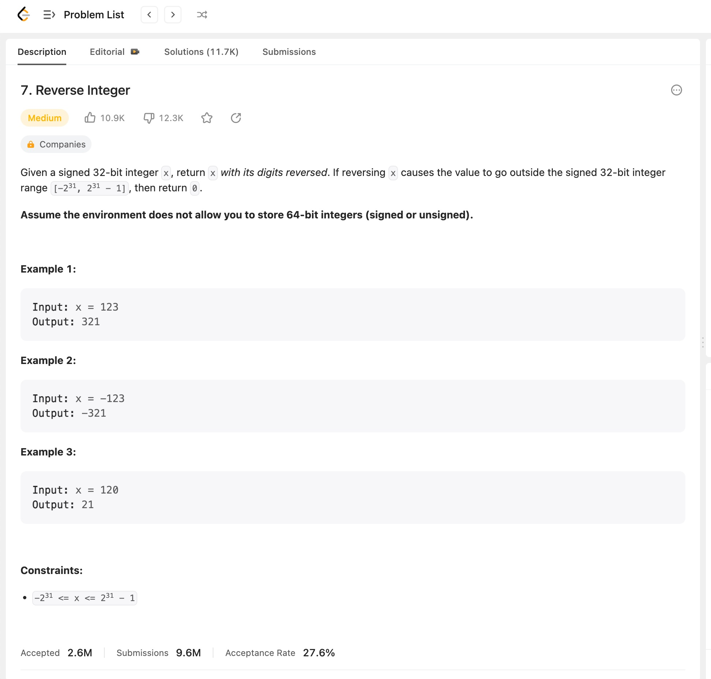

### Step 1: Open Visual Studio Code and create a new Java file

Open Visual Studio Code and create or navigate to a directory where you want to create a new Java file. Make sure that your GitHub Copilot is enabled and tuned on. In this demo, we will create a new Java file called `Puzzle.java`.

Right click on the directory and select **New File**.

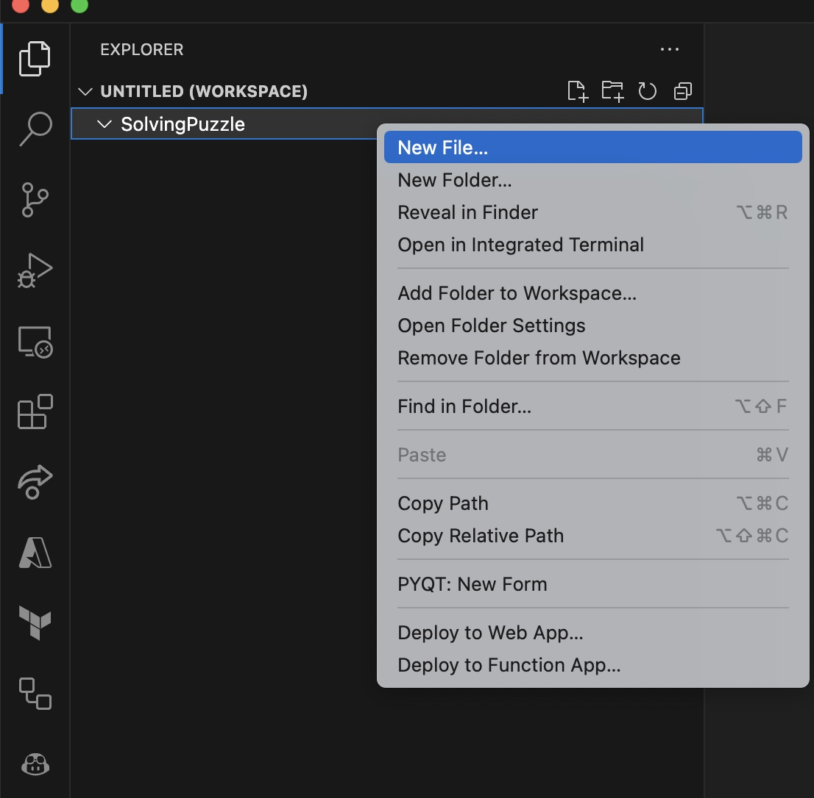

Then, give a name. I will call this `Puzzle.java`.

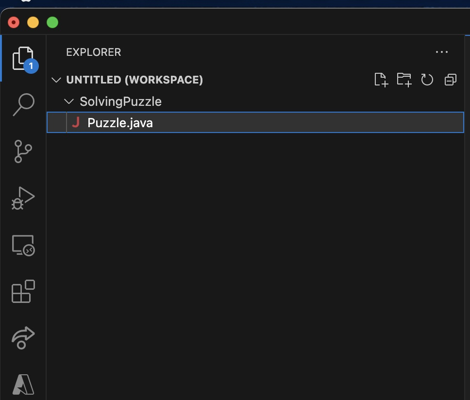

Your Visual Studio Code should look like this. We are now ready to write some code through GitHub Copilot.

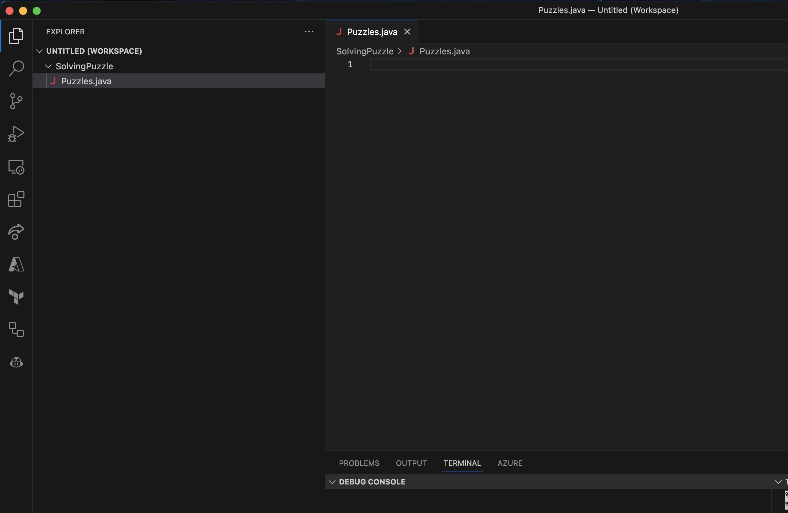

### Step 2: Start writing codes through GitHub Copilot

Let's start writing codes. We will start with a simple Java class.

```java
public class Puzzle {
    
}
```

Depending on whether you used Copilot, you may that Copilot might be suggesting you different things on fly. You can keep typing to ignore what Copilot suggests. Remember. You are the main pilot, and GitHub Copilot is just an assistance.

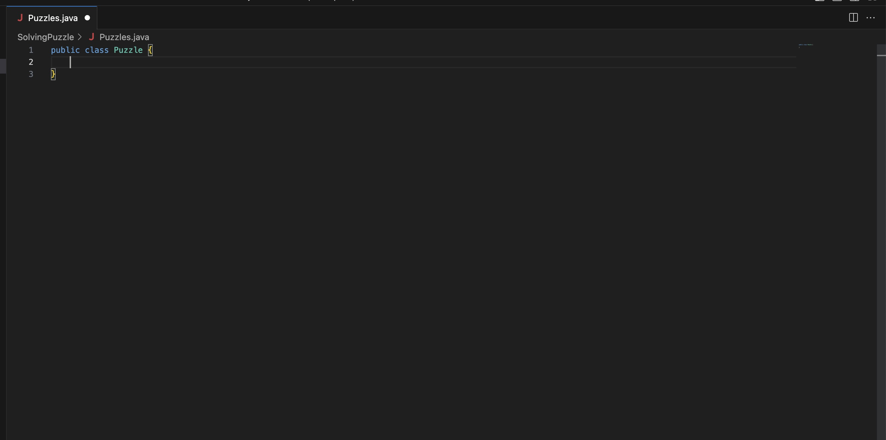

Let's add a function next. GitHub Copilot can suggest based on few things:

- Comment you write above the class, the line, function, etc
- Overall context of what you wrote
- What you wrote earlier in the history
- Name of files, functions, etc

We will name this function `reverse` which returns `int` but also accepts `int`.

```java
public int reverse(int x) {

}
```

Again, GitHub COpilot will suggest you you write. You can keep typing to ignore what Copilot suggests.

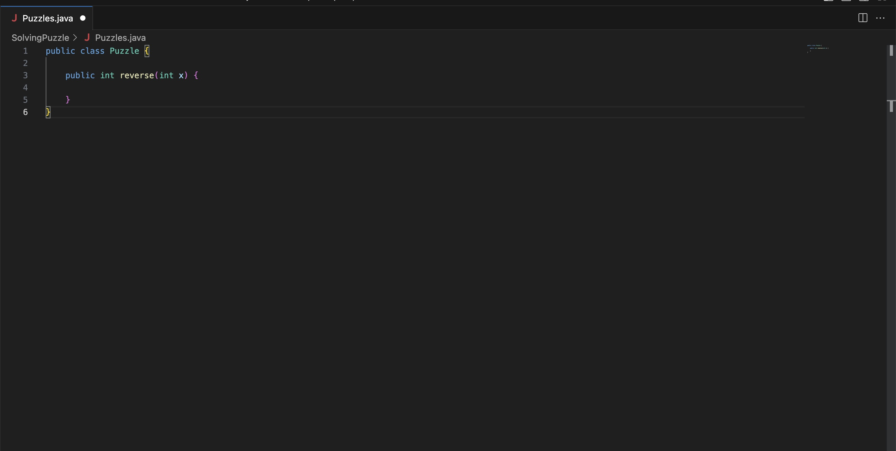

After you typed, it will suggest codes like this. Your result might look different, and what we want really does not matter.

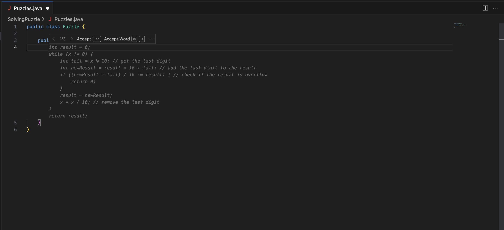

Notice that your Copilot icon on bottom right corner spins as GitHub Copilot is thinking. 

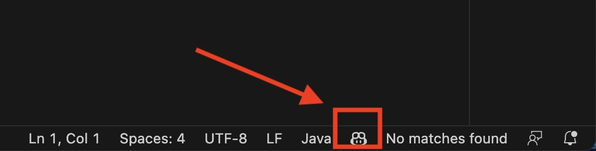

You can also select **Output** at the bottom if you have **Terminal** open, and change the drop down to **GitHub Copilot**.

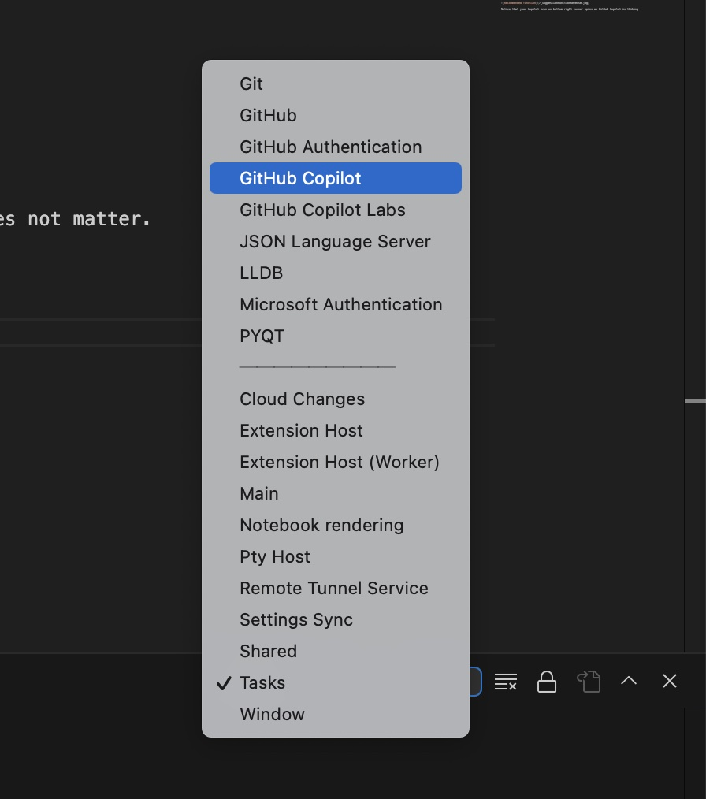

And it will look like this. You can see what gets generated as you type

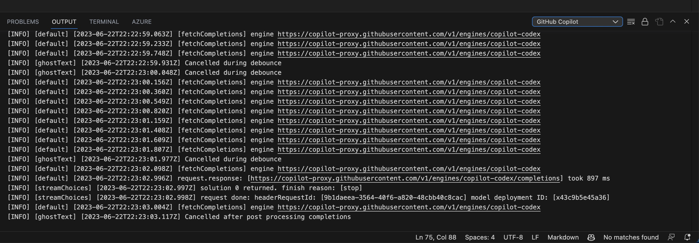

Try to accept the solution now, and try to add main function like this. You can just start typing the following so it can generate the result.

```java
public static void main(String[] args) {
    
}
```

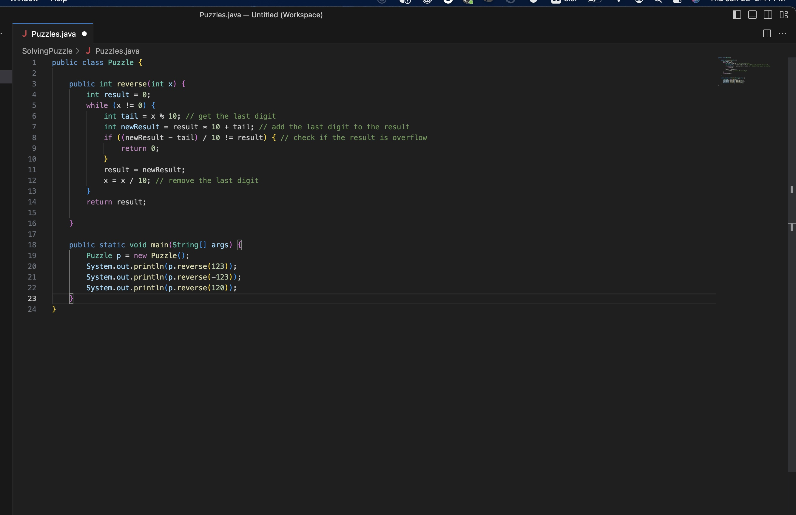

### Step 3: Let's run it and see what happens

Next, we will test our code. Open a new **Terminal** by going to **Terminal** menu and select **New Terminal**.

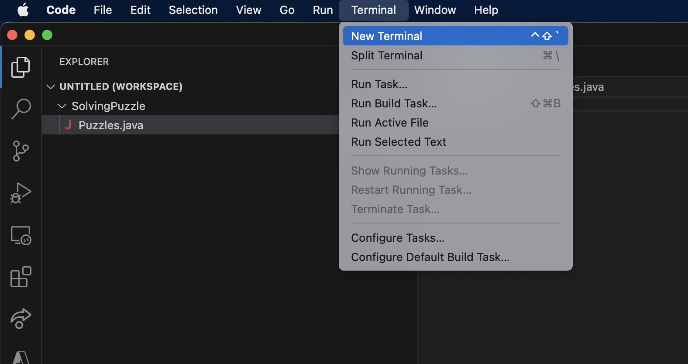

Then, you will have a new terminal open. Make sure that you had a Java SDK installed as a prerequisite. You can check by typing `java -version` in the terminal.

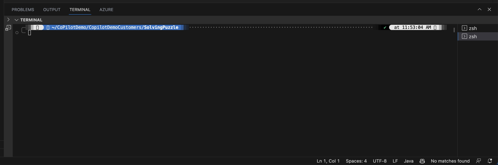

Then, you can compile your code first with `javac Puzzle.java` and run it with `java Puzzle`. You should see the following result.

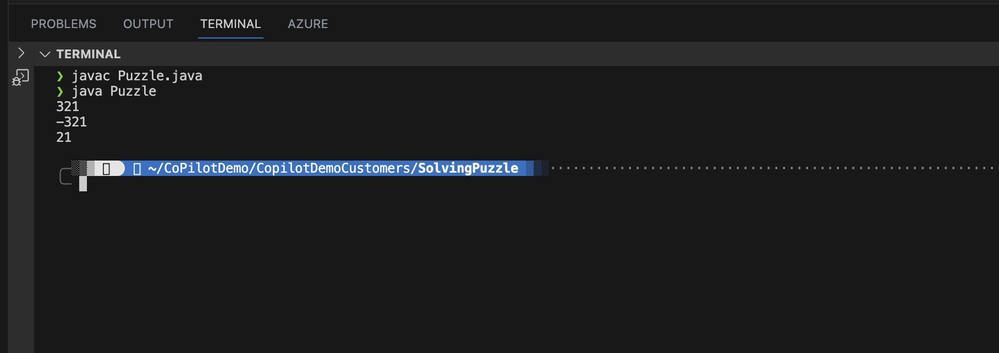

That is great! But that might not be the exact result looking for. Let's try to add a comment that was provided from Leetcode to make it more accurate.

### Step 4: Fix the result by providing a comment

GitHub Copilot can also detect the changes and suggest you with new context. Now, there is a field called **Prompt Engineering**. To get the best result, you really need to think about what type of things to ask Copilot and to judge for yourself if it is right or wrong. In this case, we will add a comment that was provided from Leetcode.

> Given a signed 32-bit integer x, return x with its digits reversed. If reversing x causes the value to go outside the signed 32-bit integer range [-231, 231 - 1], then return 0.

Then, we will add as a function comment like this. Remove everything inside function.

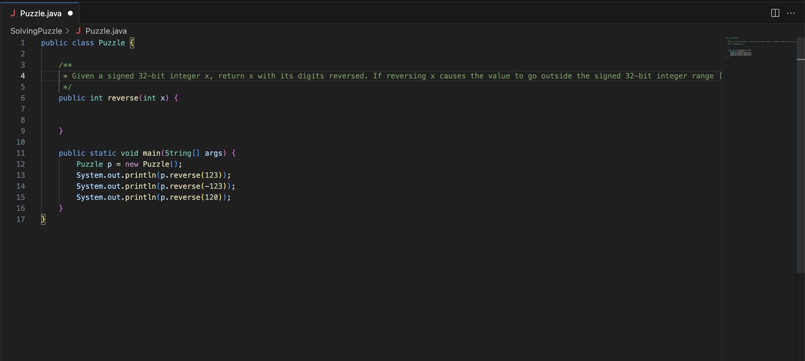

Then, you will see that GitHub Copilot will suggest you with a new function. You can accept it.

As soon as you made a new line, you will that GitHub Copilot is generating a new result. Your codes might look different from mine, but it should give a same valid result.

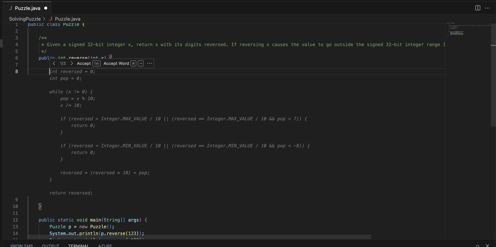

Let's accept the result by hitting tab.

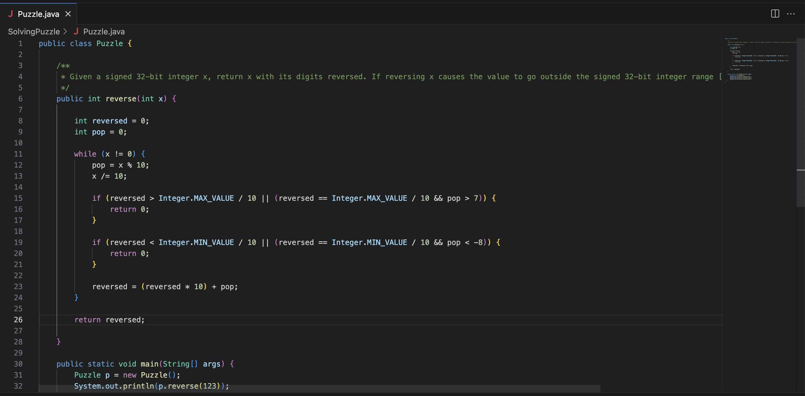

### Step 5: Provide the result to Leetcode

Finally, let's actually copy the code and paste it to Leetcode's problem.

[Reverse Integer](https://leetcode.com/problems/reverse-integer/).

And hit **Run Code**.

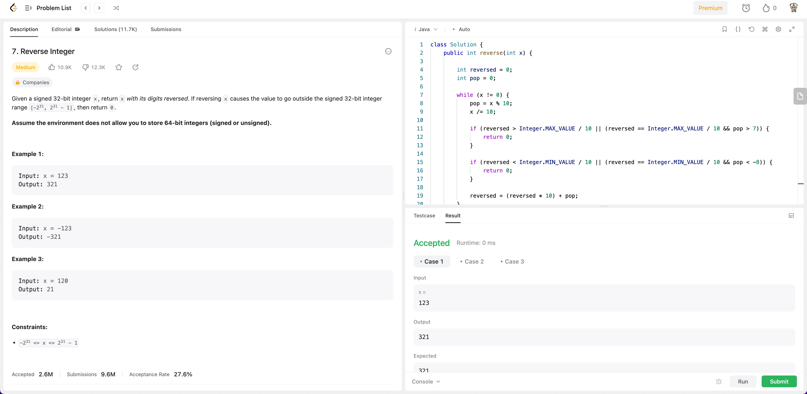

Voila! You can see Leetcode successfully passed the test. You can submit your code to Leetcode and see if you can get a higher rank. Of course, that is totally up to you.