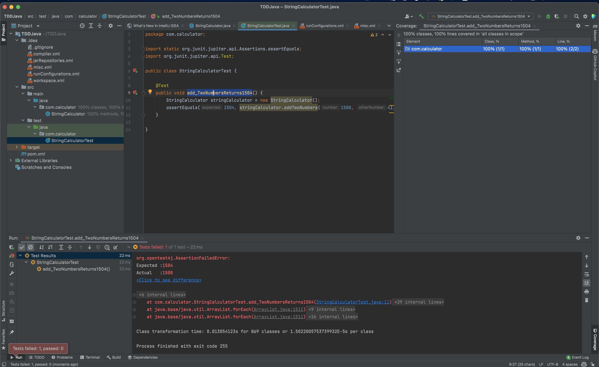
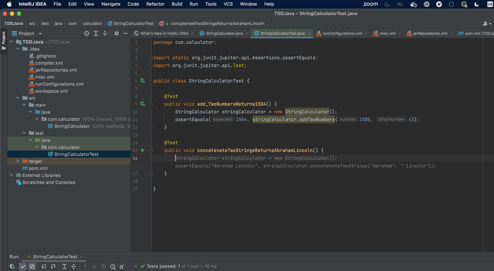

# Test Driven Development (TDD) with Java through IntelliJ

**Test-Driven Development (TDD)** is a software develpment proces relying on software requirements being converted to test cases before software is fully developed. Since unit testing or any type of functional or performance testings are very important in Java development, TDD practice is very highly encouraged among Java developers. Copilot is a great tool to help Java developers to write unit tests for their Java code as it can helps to bootstrap a lot of repetitive code for unit tests.

As you can see in the picture below, TDD process involves writing tests first, see if it fails (goes to red), then write code to make the test pass (green). Copilot can help you to write the test code and you can focus on writing the code to make the test pass.

This demo is focusing around how to use Copilot to easily write unit tests for Java code. We will be using IntelliJ IDEA for this demo.

## Prerequisites

- [Installed IntellI IDEA](https://www.jetbrains.com/idea/download/)
- [GitHub Copilot Extension for IntellJ](https://plugins.jetbrains.com/plugin/17718-github-copilot)
- [Maven](https://maven.apache.org/download.cgi)
- [Download a sample project codes called TDDJava](./TDDJava)

[See this documentation on how to install Copilot extension for IntelliJ](/CopilotExtnsion4IntelliJ)

## Steps

Welcome! In this starting Copilot demo for **Test Driven Development (TDD) using IntelliJ**, you will start with a sample **Java + Maven** projects that contain some starting codes that can help you to implement TDD using Copilot.

### Step 1: Download a sample project

First, you need to download a sample project called [**TDDJava**](./TDDJava). This is a simple Java project that contains some starting codes that can help you to implement TDD using Copilot.

### Step 2: Open the project in IntelliJ

Open the project in IntelliJ. You can open the project by clicking on **Open** in IntelliJ and select the **TDDJava** folder.

When you see a message like below, select **Trust Project**.

### Step 3: Explore code and fix some structure

You can explore the code in the project. You can see that there is a Java class called `StringCalculator` under `src/main/java` and a sample unit test class called `StringCalculatorTest` under `src/test/java`. You can also see that there is a `pom.xml` file that contains Maven configuration for this project.

You might need to configure Maven if you have some problem building because the project requires few dependencies like Junit. In addition, your test code `StringCalculatorTest` might not recognized as a Java file in some case. If that is a case, please follow this optional step.

#### Optional: Convert a plain code to Java code

Select the file name `StringCalculatorTest` and press mouse click and Control button. Then, select **Override File Type**.

Then, select **Java**.

### Step 4: Fix Project Structure

You probably also need to fix **Project Structure** by setting a right **Java Development Kit (JDK).** You can do that by clicking on **File** and select **Project Structure**.

Then, select **Project** and select a right **Project SDK**. 

In this case, I am using **Java 20 version 20.0.1**, but IntellJ also have an option to download JDK for you. You can click on **Download JDK** and select a right version of JDK.

### Step 5: Test out first test and fix it

Now, you can run the test by right click on the test class `StringCalculatorTest` and select **Run 'StringCalculatorTest'**. Or, you can select an individual test function and run it by right click on the test function and select **Run 'add_TwoNumbers...'**.

You will see that the test fails because the test is expecting the result to be 1504, but the actual result is 1500. What is going on? Well, let's find out!

If you check the code in `StringCalculator` class, you will see that the `add` function just returns first `number`. So, how do we fix this?

No worry! GitHub Copilot is smart to fix this right away by just making a space after number. However, it is still your job to make sure that the code is correct. After all, your are the main pilot, not your Copilot.

After you took the suggestion, let's go back and run the test again. You can run the test by right click on the test class `StringCalculatorTest` and select **Run 'StringCalculatorTest'**. And it is successful this time! We just went from a failure to a success. That is a great progress!

### Step 6: Adding a second test function called concatenateTwoStrings

Now, we will implement a second test function called `concatenateTwoStrings` that will concatenate two Strings. You can do that by adding a new test function in `StringCalculatorTest` class. After making new lines, just add `@Test`, and your Copilot is giving you some suggestions. 

However, that is not what we want. Let's override by typing a test function name that reflects what we really want to do. In this case, we want to concatenate two Strings. So, let's type `concatenateTwoStringsAbrahamLincoln`, and Copilot will give you some suggestions.

Once we accepted the generated code, we have few options. IntelliJ does have a built-in feature to generate the code based on function name, etc, like this.

But, we want to focus on Copilot driven development. So, let's go to `StringCalculator` class and implement the function. As soon as you type, it will give you a suggestion for the function name by cross-referencing what you typed in `StringCalculatorTest` class.

Run the test again, and it will become successful!. Great job.

### Step 7: Last exercise for implementing a third test function called findLargestNumberFromList

We can stop from there, but let's maybe do one more exercise. We can implement a test and a code to find the largest number from a provided list. We start typing a test function name in `StringCalculatorTest` class.

Once if we are happy with what Copilot suggests, we can accept the solution. Just like last time, let's go create this function in `StringCalculator` class.

Although this is slightly more complex function, Copilot really makes this super easy. Just look at how fast it can generate the result

Let's accept the solution.

Now, let's run the test again. And it is successful! Congratulation! You just finished Test Driven Development using GitHub Copilot.

