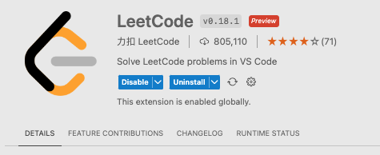
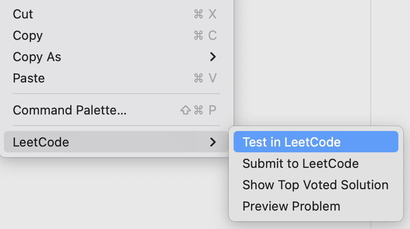

# Copilot Prompt Crafting

An exercise Repo for Copilot Prompt-Crafting, to complement the Copilot Fundamentals Training (L100)

## Learning Objectives

Practice some Prompt Crafting with GitHub Copilot Chat.

---

## Prerequisites

- Copilot 
- Copilot Chat

**Optional**
>Note: **DEMO 4** is an advanced demo that requires the use of the [VS-Code Leetcode extension](https://marketplace.visualstudio.com/items?itemName=LeetCode.vscode-leetcode)

---

## DEMO 1

### Zero-shot 

```
Write me unit tests for all the operations in my calculator.js file
```

### One-Shot
 ```
 Write me unit tests for all the operations in my calculator.js file
Use the following example: test(‘adds 1 + 2 to equal 3’, () => ( expect(calculate(1, 2 ‘+’)).toBe(3); });
```
---

## DEMO 2 

### Zero-shot 
```
Can you create an HTML calculator for me?
```

### One-Shot

```
Can you create an HTML calculator for me? Use the following example:  
<!DOCTYPE html>
<html>
  <head>
    <title>Calculator</title>
    <link rel="stylesheet" href="style.css">
  </head>
<body> 
```

---

## DEMO 3

### Zero-shot 

```
Can you write me the code for a snake game?
```

### One-Shot

```
Can you write me the code for a snake game? 
Example: Ensure that there is a leaderboard mechanic
```
---

## DEMO 4 - [LeetCode](https://leetcode.com) (Advanced Demo)

This demo uses a **very** detailed prompt with examples to guide Copilot in generating effective suggestions.

### Setup and detailed walkthrough with the <a href="https://marketplace.visualstudio.com/items?itemName=LeetCode.vscode-leetcode">LeetCode extension</a>
<p></summary>

#### 1. Install the <a href="https://marketplace.visualstudio.com/items?itemName=LeetCode.vscode-leetcode">LeetCode extension</a> in VS-Code

   

#### 2. Log into the LeetCode website.

 <p style="margin-left: 30px;">2.1 &nbsp; &nbsp;At the time of writing this document, the LeetCode extension may experience difficulties with logging in to leetcode.com. For guidance on connecting to the website, please refer to the instructions provided in this <a href="https://betterprogramming.pub/work-on-leetcode-problems-in-vs-code-5fedf1a06ca1">blog</a>.</p>

#### 3. When you are connected to `leetcode.com`, start with some exercise.
<p style="margin-left: 30px;">1. Open the `leetcode` extension
</p>
<p style="margin-left: 30px;">2. Select a problem to solve.
</p>
<p style="margin-left: 30px;">3. Start the coding exercise.
</p>
<p style="margin-left: 30px;"><b>NOTE:</b> before <b>leetcode</b> opens a solution file, it will ask for some info:
</p>
<p style="margin-left: 30px;">We recommend to use the following options:

- `Select an implementation language` (your choice)

- `Just open the problem file` (opens a new tab)

</p>

<p style="margin-left: 30px;"></p>

#### 4. Now use the problem descption from **leetcode** with Copilot Chat (copy & paste), ask it to create the code.

#### 5. When you accepted the suggestion from copilot chat (copy into file).
Use the right click pop-up menu in the solutions file to `test` and `submit` your solution to **leetcode**

<p style="margin-left: 30px;"></p>

---

#### The final step is to evaluate the Copilot suggestion for its 'pass' or 'fail' status and to determin its corresponding 'score'.

#### Good Luck !

