# Getting started - Solving algorithm puzzle of distributing swag items - Visual Studio Code

Welcome to GitHub Copilot!

Probably not too surprisingly, GitHub Copilot is very good at solving algorithm puzzles. In this demo, we will show how GitHub Copilot can actually helped to solve a real problem -- distributing swag items to lockers.

Here is a story. We have a number of different swag items to distribute to some employees as a part of appreciation. Now, we have some tumbers, bag packs, shirts of different sizes, and hoodies of different sizes. The problem is that we want to put these on lockers so it can be sort of self-service based where each person can walk up to a locker, type in a passcode, and can take out a bundle of swag items. The problem is that passcode for each locker has to be unique -- consisting for 4 digits. So, we need to figure out how to distribute these swag items to lockers so that each locker has a unique passcode.

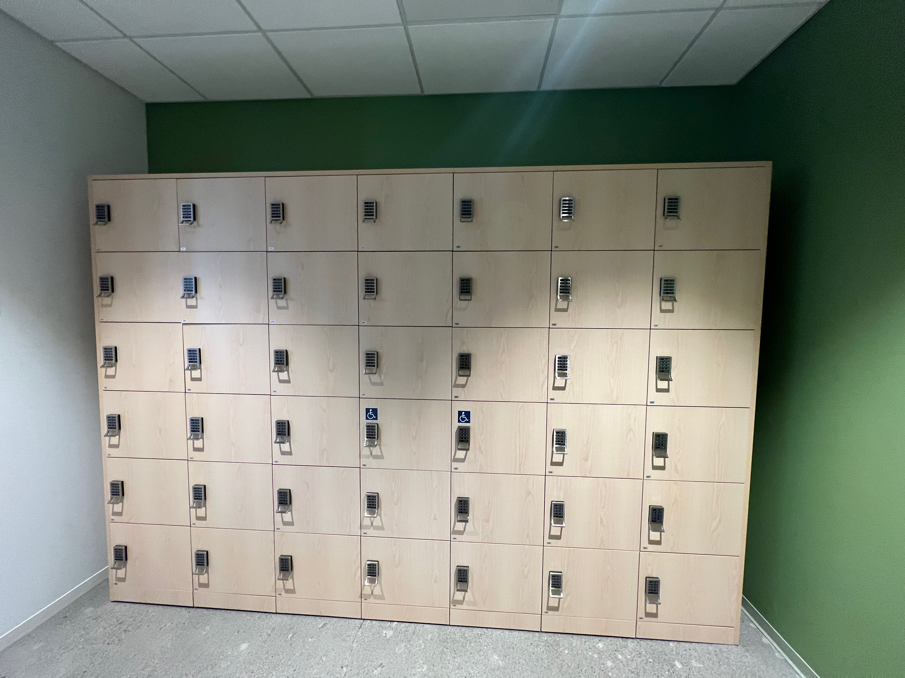

## Prerequisites

- [Copilot Extension for Visual Studio Code](https://code.visualstudio.com/download)
- Python

## Steps

Let's take one step at a time to solve this problem.

### Step 1: Create a new file

First, let's create a new file in Visual Studio Code. It will be also nice to put inside an uniquely named folder.

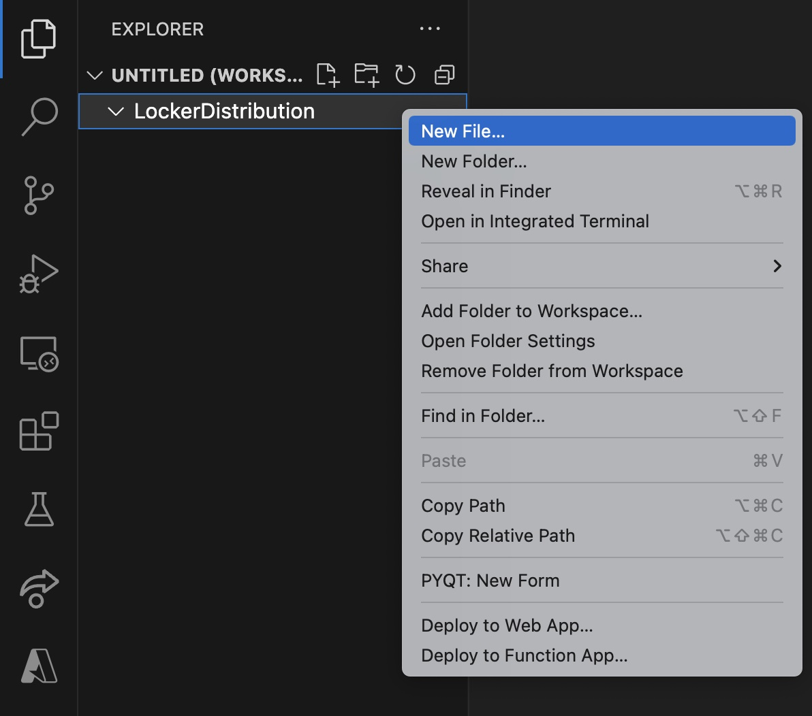

I named this file `locker-distribution.py`, but you can call it whatever you want. From that new file, you can start typing a comment starting with a hash sign. Copilot can suggest based on comments, function  name, previous context, etc.

### Step 2: Type a comment to make Copilot suggest code snippets

Since we are trying to solve a problem earlier, this was what I typed.

```python
# # Generate a N x M matrix where each cell represents a locker where N is a number of rows and M is number of columns.
# Each cell should have a randomly generated integer locker code with length 4.
```

More description is better. Copilot will try to understand what you are trying to do and will suggest code snippets.

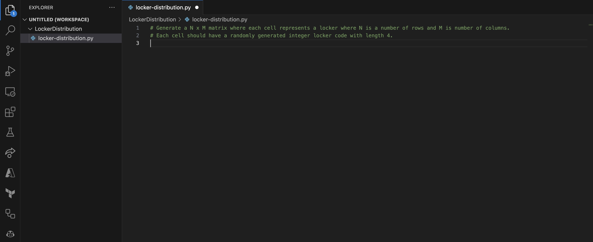

Then, as you can see, Copilot suggested a code snippet. You can press `Tab` key to accept the suggestion. You can also press `Ctrl+Space` to see more suggestions.

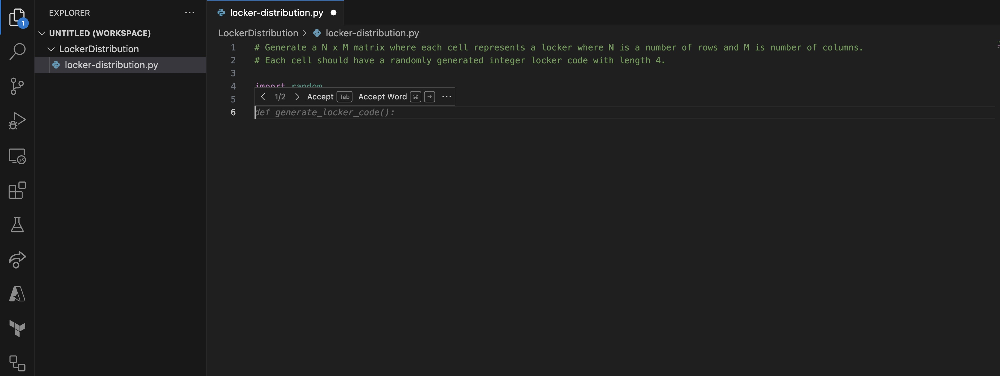

If you are quick, you might have noticed that Copilot icon on bottom right corner of the editor is spinning. That means Copilot is working hard to understand what you are trying to do and will suggest more code snippets.

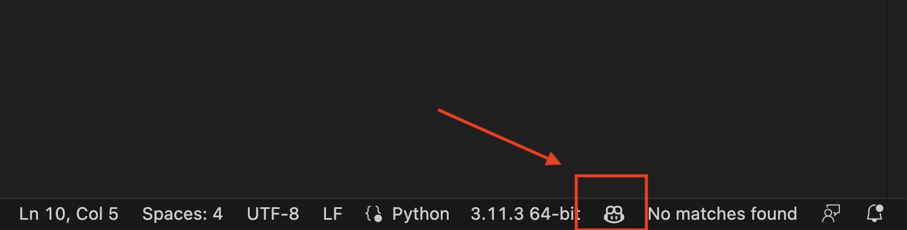

You might have to keep enter and hit tab to accept suggestions. The completed code might look like this, but your result might be different. That is because Copilot is learning and can generate dynamic results.

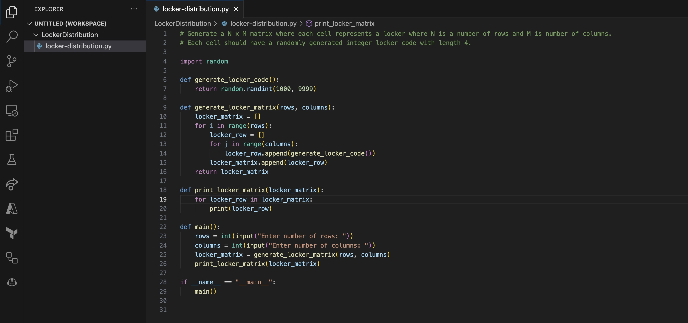

### Step 3: See some outputs from Copilot

Now, let's see some processes coming from Copilot. Click **Terminal** on top menu and select **New Terminal**. This will open a new terminal window at the bottom of the editor.

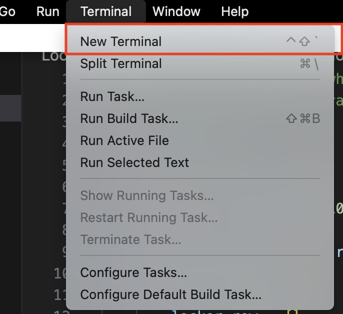

Let's select **OUTPUT** tab first.

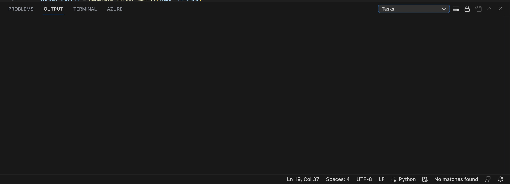

After that, let's click drop down menu on the terminal window and select **GitHub Copilot**.

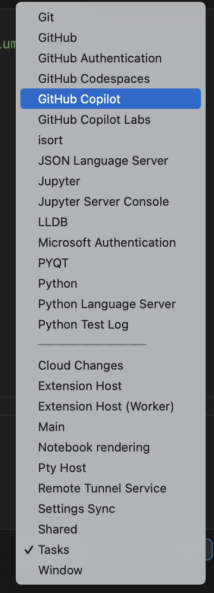

Then, you will see some telemetries from Copilot. You can see what Copilot is doing in the background, and this will get updated whenever Copilot **thinks**.

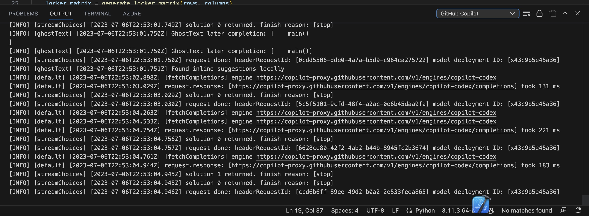


### Step 4: Run Python script

Let's verify our first Python result. Click **TERMINAL** tab.

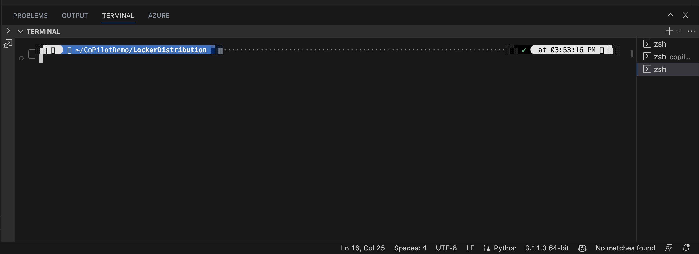

Then, type `python locker-distribution.py` and hit enter. You should see some results.

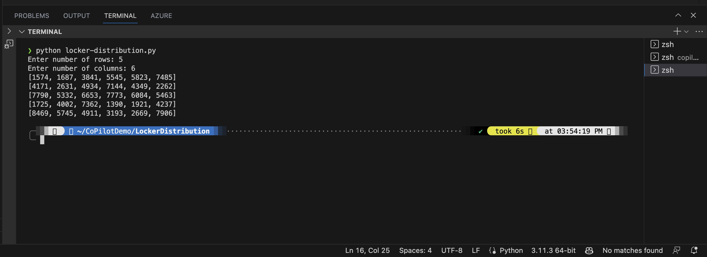

And this should be what it should look like in full view.

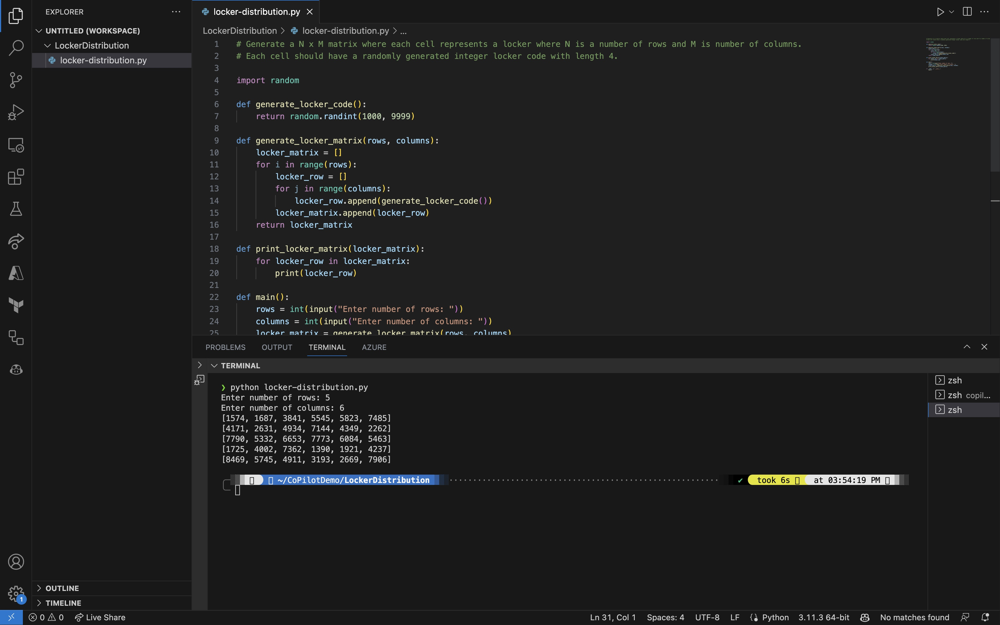

This solved our initial problem for at least generating random code for each locker. But what if we want to distribute swag items as well?

### Step 5: Modify the code to handle more complicated logic

We will change our earlier logic to handle more complicated scenario. Let's change our code to look like this.


Next, we need to be descriptive as much as possible. I typed in like this.

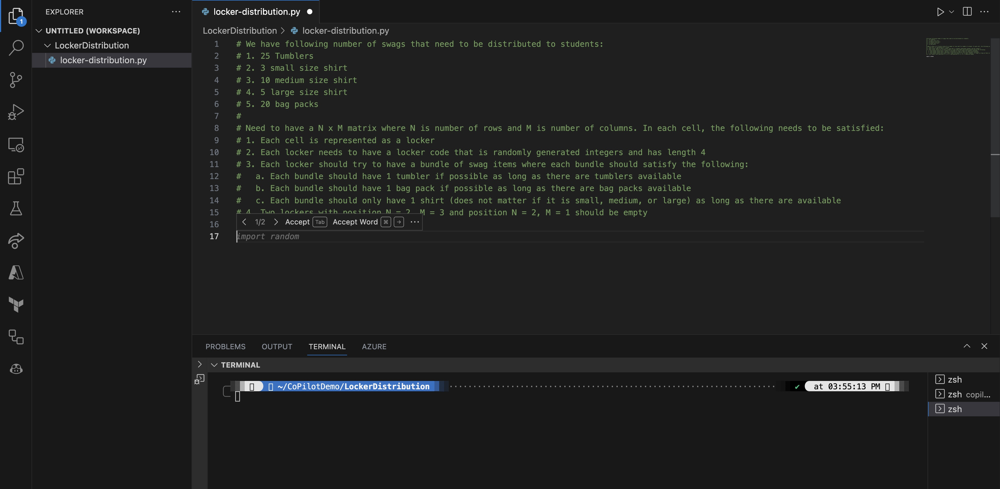

```python
# We have following number of swags that need to be distributed to students:
# 1. 25 Tumblers
# 2. 3 small size shirt
# 3. 10 medium size shirt
# 4. 5 large size shirt
# 5. 20 bag packs
# 
# Need to have a N x M matrix where N is number of rows and M is number of columns. In each cell, the following needs to be satisfied:
# 1. Each cell is represented as a locker
# 2. Each locker needs to have a locker code that is randomly generated integers and has length 4
# 3. Each locker should try to have a bundle of swag items where each bundle should satisfy the following:
#   a. Each bundle should have 1 tumbler if possible as long as there are tumblers available
#   b. Each bundle should have 1 bag pack if possible as long as there are bag packs available
#   c. Each bundle should only have 1 shirt (does not matter if it is small, medium, or large) as long as there are available
# 4. Two lockers with position N = 2, M = 3 and position N = 2, M = 1 should be empty
```

As you enter and type, Copilot will try to understand what you are trying to do and will suggest code snippets. But it also hallcinates like this.

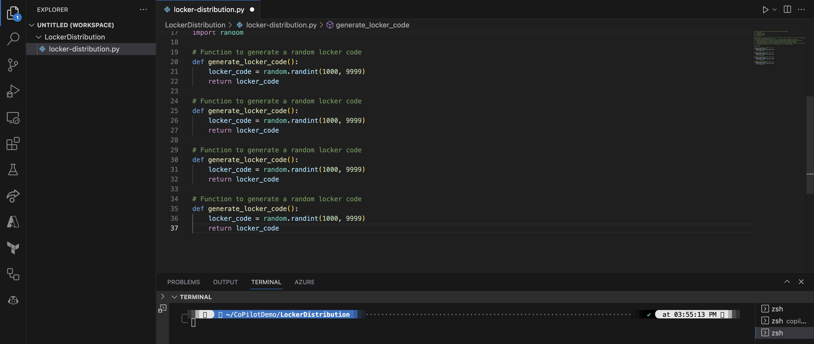

You can take the suggestion again, but it possiblethat things get repeated over and over.

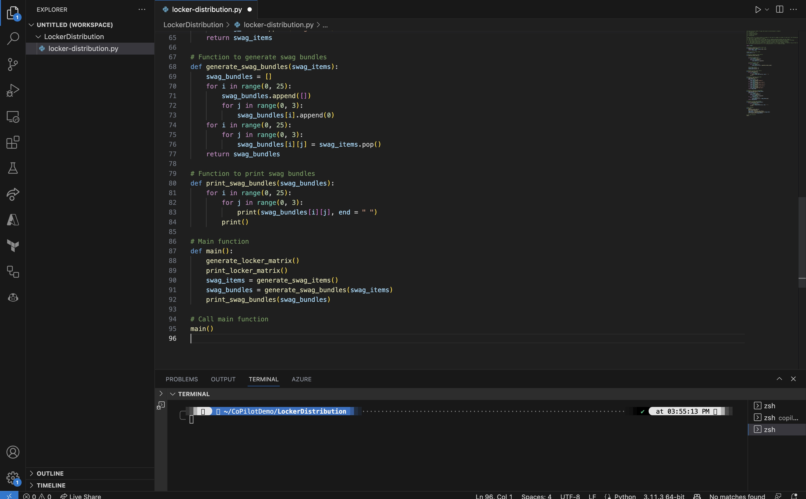

Of course, you can also encounter error at any point of time. 

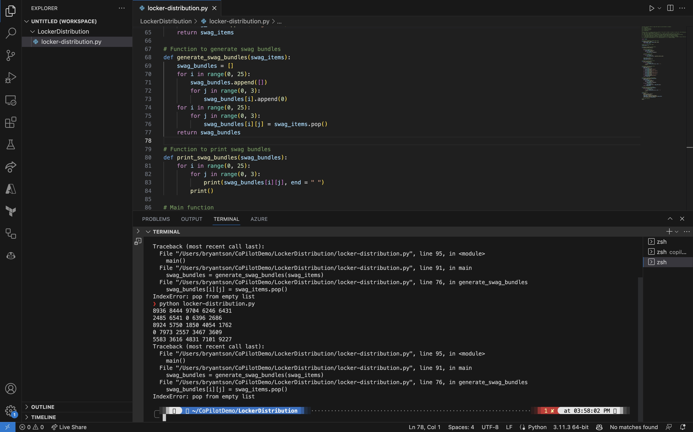


But that should be fine. Errors are expected, and remember. You are the main pilot, and Copilot is jst your companion. You can always override and change the code.
