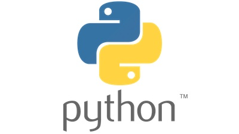

# Copilot Demos for Python developers

This contains a collection of demos for Copilot for Python programming language. This is going to be useful for customers who are interested in using Python development with Copilot.

For Python customers, they are likely to use Jetbrains PyCharm, more than Visual Studio Code. Unfortunately, Copilot is not available for Pycharm or its variations.

> GitHub Copilot is only available for VS Code, Visual Studio IDE, NeoVim, and IntelliJ and GitHub Copilot is not available for Pycharm IDE.

## Prerequisites

These demos are done with VS Code.

- [Visual Studio Code](https://code.visualstudio.com/download)

## Demos

You want to start with basic one then jump to other ones.

1. [Getting started - Solving algorithm puzzle: Figuring out locker swag distribution - Visual Studio Code](Demos/GettingStarted/README.md)

## Contribution

If you want to contribute to this repo, please follow the [Contribution Guidelines](CONTRIBUTING.md).

